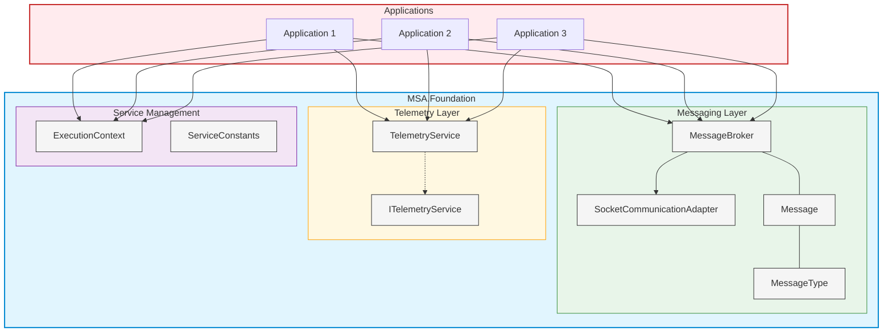
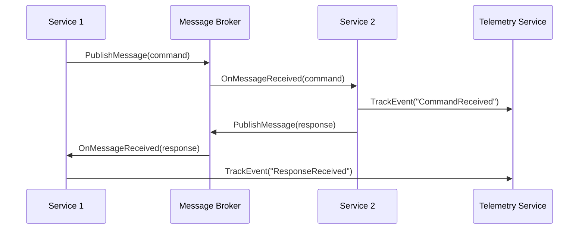

# MSA.Foundation Architecture Overview

## Introduction

MSA.Foundation is a reusable architectural framework designed to simplify the development of microservice-based applications. It provides a set of core components for messaging, telemetry, and service management that can be shared across multiple projects.

## Key Components

## Architectural Principles

### 1. Separation of Concerns

MSA.Foundation follows strict separation of concerns by dividing functionality into three main layers:

- **Messaging**: Handles all communication between services
- **Telemetry**: Provides monitoring, logging, and performance tracking
- **Service Management**: Manages service lifecycle and configuration

### 2. Dependency Inversion

The framework uses interfaces and dependency injection to ensure components are loosely coupled:

- `IMessageBroker` interface allows different messaging implementations
- `ITelemetryService` interface supports various telemetry providers
- Service components depend on abstractions, not concrete implementations

### 3. Cross-Platform Compatibility

All components are designed to work across different platforms:

- .NET 8.0 based for cross-platform support
- Platform-agnostic communication via ZeroMQ
- Cloud-friendly telemetry with Application Insights

## Communication Flow

## Integration Patterns

MSA.Foundation supports several integration patterns:

1. **Request/Response**: For synchronous communication between services
2. **Publish/Subscribe**: For event-driven architectures
3. **Command**: For direct service control
4. **Event**: For loose coupling and scalability

## Deployment Model

The framework supports flexible deployment options:

- **In-Process**: Services running as threads within a single process
- **Cross-Process**: Services running as separate processes on a single machine
- **Distributed**: Services running across multiple machines or containers

## Configuration

Configuration is handled through a combination of:

- Environment variables for secrets and environment-specific settings
- ServiceConstants for static configuration
- JSON configuration files for application settings

## Extensibility

MSA.Foundation is designed for extensibility:

- Custom message types can be added to extend the messaging capabilities
- Telemetry can be extended with custom event tracking
- Service management can be customized for specific deployment scenarios

## Performance Considerations

- SocketCommunicationAdapter uses efficient binary serialization
- Telemetry batches events to minimize performance impact
- ExecutionContext manages thread lifecycle to prevent leaks

## Security

- Communication can be secured using transport-level encryption
- Telemetry includes safeguards for sensitive data
- Message validation prevents malformed messages

## Conclusion

MSA.Foundation provides a robust, extensible framework for building microservice-based applications with a focus on reliability, scalability, and maintainability. By abstracting common infrastructure concerns, it allows developers to focus on business logic rather than plumbing code.