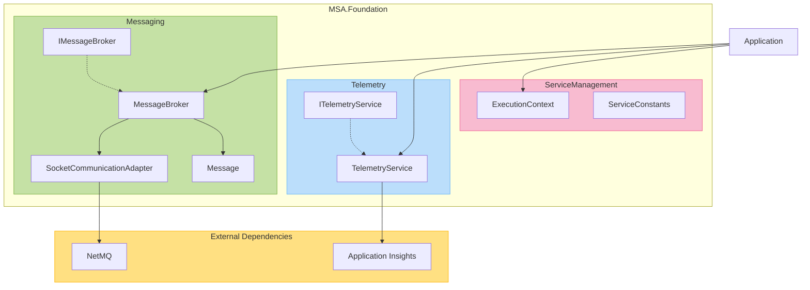
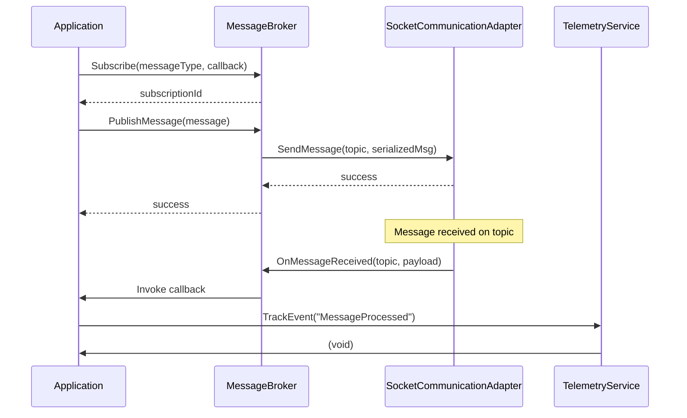
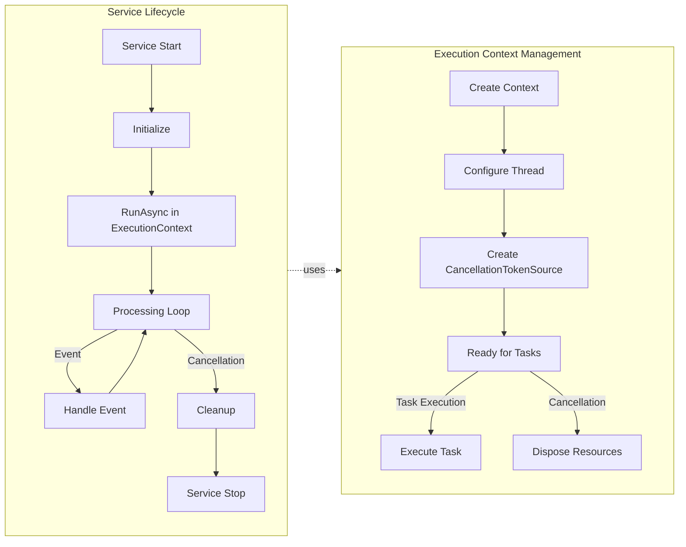

# MSA.Foundation Architecture Overview

## High-Level Architecture

```mermaid
graph TB
    subgraph MSA.Foundation["MSA.Foundation"]
        subgraph Messaging["Messaging"]
            style Messaging fill:#C5E1A5,stroke:#7CB342
            iMsgBroker["IMessageBroker"]
            msgBroker["MessageBroker"]
            socketAdapter["SocketCommunicationAdapter"]
            message["Message"]
        end
        
        subgraph Telemetry["Telemetry"]
            style Telemetry fill:#BBDEFB,stroke:#64B5F6
            iTelemetry["ITelemetryService"]
            telemetry["TelemetryService"]
        end
        
        subgraph ServiceManagement["ServiceManagement"]
            style ServiceManagement fill:#F8BBD0,stroke:#F06292
            execContext["ExecutionContext"]
            constants["ServiceConstants"]
        end
    end
    
    subgraph ExternalDeps["External Dependencies"]
        style ExternalDeps fill:#FFE082,stroke:#FFB300
        netmq["NetMQ"]
        appInsights["Application Insights"]
    end
    
    %% Relationships within MSA.Foundation
    iMsgBroker -.-> msgBroker
    msgBroker --> socketAdapter
    msgBroker --> message
    iTelemetry -.-> telemetry
    
    %% Relationships with external dependencies
    socketAdapter --> netmq
    telemetry --> appInsights
    
    %% Consumer relationship example
    app["Application"] --> msgBroker
    app --> telemetry
    app --> execContext
    
    %% Add clarifying labels
    classDef relationshipLabel text-align:left
    class Messaging relationshipLabel
    class Telemetry relationshipLabel
    class ServiceManagement relationshipLabel
```

## Component Interactions

```mermaid
sequenceDiagram
    participant App as Application
    participant Broker as MessageBroker
    participant Socket as SocketCommunicationAdapter
    participant TelSvc as TelemetryService
    
    App->>Broker: Subscribe(messageType, callback)
    Broker-->>App: subscriptionId
    
    App->>Broker: PublishMessage(message)
    Broker->>Socket: SendMessage(topic, serializedMsg)
    Socket-->>Broker: success
    Broker-->>App: success
    
    Note over Socket: Message received on topic
    Socket->>Broker: OnMessageReceived(topic, payload)
    Broker->>App: Invoke callback
    
    App->>TelSvc: TrackEvent("MessageProcessed")
    TelSvc->>App: (void)
```

## Service Management Flow

```mermaid
flowchart LR
    subgraph ServiceLifecycle["Service Lifecycle"]
        Start[Service Start] --> Init[Initialize]
        Init --> RunAsync[RunAsync in ExecutionContext]
        RunAsync --> Loop[Processing Loop]
        Loop --> |Event| Handle[Handle Event]
        Handle --> Loop
        Loop --> |Cancellation| Cleanup[Cleanup]
        Cleanup --> Stop[Service Stop]
    end
    
    subgraph ExecutionContextMgmt["Execution Context Management"]
        CreateContext[Create Context] --> ConfigThread[Configure Thread]
        ConfigThread --> TokenSource[Create CancellationTokenSource]
        TokenSource --> Ready[Ready for Tasks]
        Ready --> |Task Execution| Running[Execute Task]
        Ready --> |Cancellation| Disposed[Dispose Resources]
    end
    
    ServiceLifecycle -.-> |uses| ExecutionContextMgmt
```