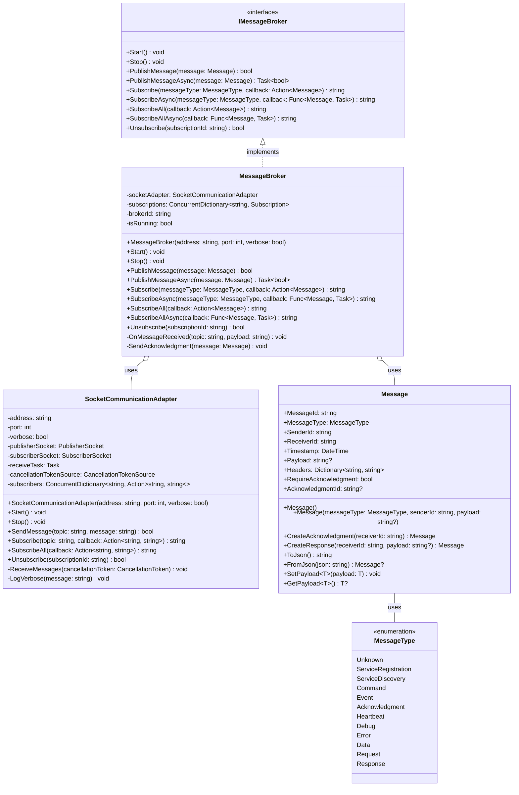
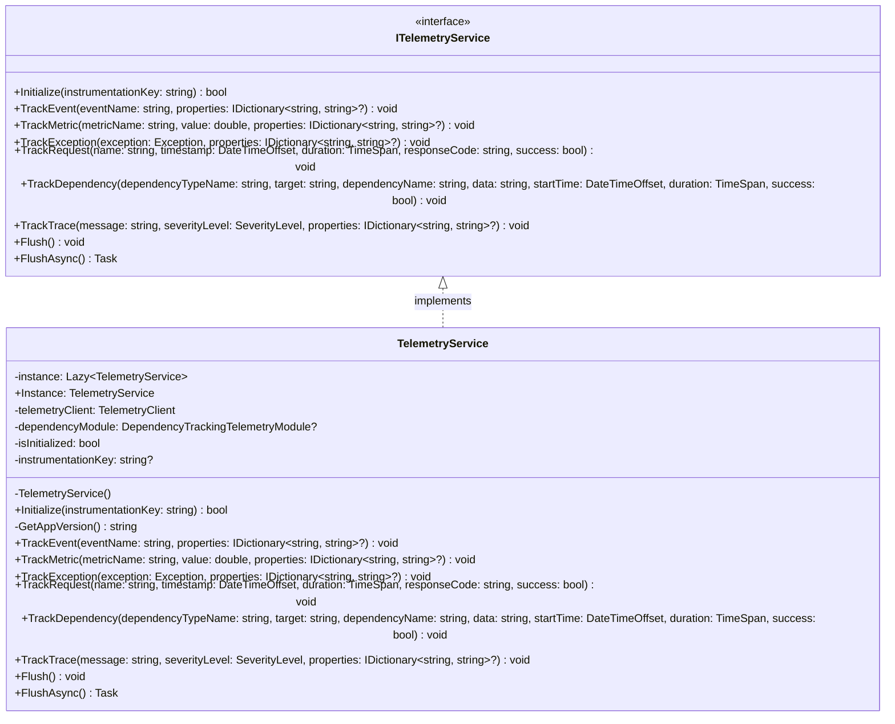
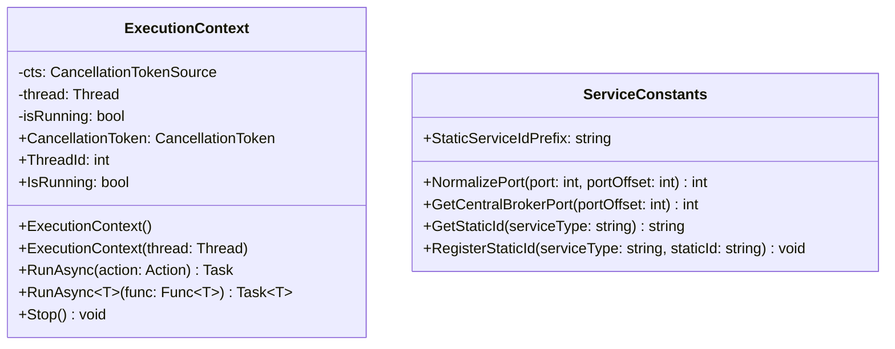

# MSA.Foundation Class Diagram

## Messaging Components

```mermaid
classDiagram
    class IMessageBroker {
        <<interface>>
        +Start() void
        +Stop() void
        +PublishMessage(message: Message) bool
        +PublishMessageAsync(message: Message) Task~bool~
        +Subscribe(messageType: MessageType, callback: Action~Message~) string
        +SubscribeAsync(messageType: MessageType, callback: Func~Message, Task~) string
        +SubscribeAll(callback: Action~Message~) string
        +SubscribeAllAsync(callback: Func~Message, Task~) string
        +Unsubscribe(subscriptionId: string) bool
    }
    
    class MessageBroker {
        -socketAdapter: SocketCommunicationAdapter
        -subscriptions: ConcurrentDictionary~string, Subscription~
        -brokerId: string
        -isRunning: bool
        +MessageBroker(address: string, port: int, verbose: bool)
        +Start() void
        +Stop() void
        +PublishMessage(message: Message) bool
        +PublishMessageAsync(message: Message) Task~bool~
        +Subscribe(messageType: MessageType, callback: Action~Message~) string
        +SubscribeAsync(messageType: MessageType, callback: Func~Message, Task~) string
        +SubscribeAll(callback: Action~Message~) string
        +SubscribeAllAsync(callback: Func~Message, Task~) string
        +Unsubscribe(subscriptionId: string) bool
        -OnMessageReceived(topic: string, payload: string) void
        -SendAcknowledgment(message: Message) void
    }
    
    class SocketCommunicationAdapter {
        -address: string
        -port: int
        -verbose: bool
        -publisherSocket: PublisherSocket
        -subscriberSocket: SubscriberSocket
        -receiveTask: Task
        -cancellationTokenSource: CancellationTokenSource
        -subscribers: ConcurrentDictionary~string, Action~string, string~~
        +SocketCommunicationAdapter(address: string, port: int, verbose: bool)
        +Start() void
        +Stop() void
        +SendMessage(topic: string, message: string) bool
        +Subscribe(topic: string, callback: Action~string, string~) string
        +SubscribeAll(callback: Action~string, string~) string
        +Unsubscribe(subscriptionId: string) bool
        -ReceiveMessages(cancellationToken: CancellationToken) void
        -LogVerbose(message: string) void
    }
    
    class Message {
        +MessageId: string
        +MessageType: MessageType
        +SenderId: string
        +ReceiverId: string
        +Timestamp: DateTime
        +Payload: string?
        +Headers: Dictionary~string, string~
        +RequireAcknowledgment: bool
        +AcknowledgmentId: string?
        +Message()
        +Message(messageType: MessageType, senderId: string, payload: string?)
        +CreateAcknowledgment(receiverId: string) Message
        +CreateResponse(receiverId: string, payload: string?) Message
        +ToJson() string
        +FromJson(json: string) Message?
        +SetPayload~T~(payload: T) void
        +GetPayload~T~() T?
    }
    
    class MessageType {
        <<enumeration>>
        Unknown
        ServiceRegistration
        ServiceDiscovery
        Command
        Event
        Acknowledgment
        Heartbeat
        Debug
        Error
        Data
        Request
        Response
    }
    
    IMessageBroker <|.. MessageBroker : implements
    MessageBroker o-- SocketCommunicationAdapter : uses
    MessageBroker o-- Message : uses
    Message -- MessageType : uses
```

## Telemetry Components

```mermaid
classDiagram
    class ITelemetryService {
        <<interface>>
        +Initialize(instrumentationKey: string) bool
        +TrackEvent(eventName: string, properties: IDictionary~string, string~?) void
        +TrackMetric(metricName: string, value: double, properties: IDictionary~string, string~?) void
        +TrackException(exception: Exception, properties: IDictionary~string, string~?) void
        +TrackRequest(name: string, timestamp: DateTimeOffset, duration: TimeSpan, responseCode: string, success: bool) void
        +TrackDependency(dependencyTypeName: string, target: string, dependencyName: string, data: string, startTime: DateTimeOffset, duration: TimeSpan, success: bool) void
        +TrackTrace(message: string, severityLevel: SeverityLevel, properties: IDictionary~string, string~?) void
        +Flush() void
        +FlushAsync() Task
    }
    
    class TelemetryService {
        -instance: Lazy~TelemetryService~
        +Instance: TelemetryService
        -telemetryClient: TelemetryClient
        -dependencyModule: DependencyTrackingTelemetryModule?
        -isInitialized: bool
        -instrumentationKey: string?
        -TelemetryService()
        +Initialize(instrumentationKey: string) bool
        -GetAppVersion() string
        +TrackEvent(eventName: string, properties: IDictionary~string, string~?) void
        +TrackMetric(metricName: string, value: double, properties: IDictionary~string, string~?) void
        +TrackException(exception: Exception, properties: IDictionary~string, string~?) void
        +TrackRequest(name: string, timestamp: DateTimeOffset, duration: TimeSpan, responseCode: string, success: bool) void
        +TrackDependency(dependencyTypeName: string, target: string, dependencyName: string, data: string, startTime: DateTimeOffset, duration: TimeSpan, success: bool) void
        +TrackTrace(message: string, severityLevel: SeverityLevel, properties: IDictionary~string, string~?) void
        +Flush() void
        +FlushAsync() Task
    }
    
    ITelemetryService <|.. TelemetryService : implements
```

## Service Management Components

```mermaid
classDiagram
    class ExecutionContext {
        -cts: CancellationTokenSource
        -thread: Thread
        -isRunning: bool
        +CancellationToken: CancellationToken
        +ThreadId: int
        +IsRunning: bool
        +ExecutionContext()
        +ExecutionContext(thread: Thread)
        +RunAsync(action: Action) Task
        +RunAsync~T~(func: Func~T~) Task~T~
        +Stop() void
    }
    
    class ServiceConstants {
        +StaticServiceIdPrefix: string
        +NormalizePort(port: int, portOffset: int) int
        +GetCentralBrokerPort(portOffset: int) int
        +GetStaticId(serviceType: string) string
        +RegisterStaticId(serviceType: string, staticId: string) void
    }
```