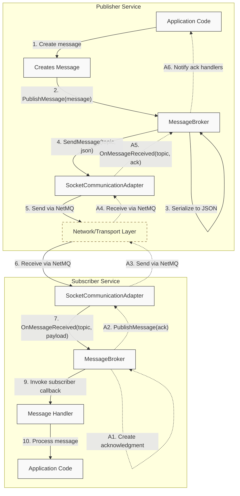
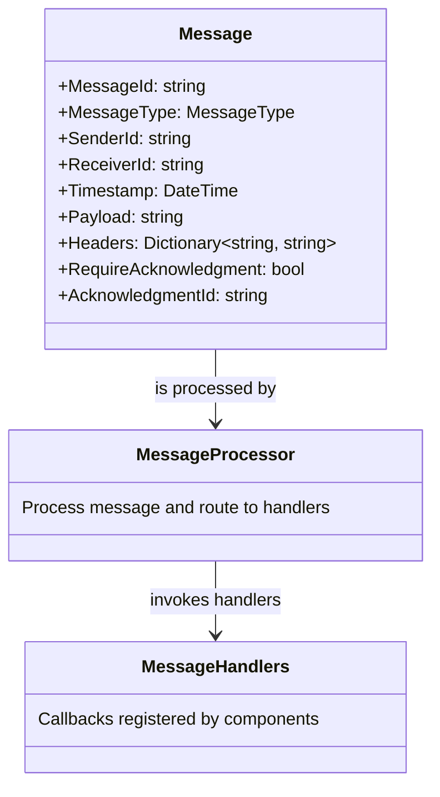
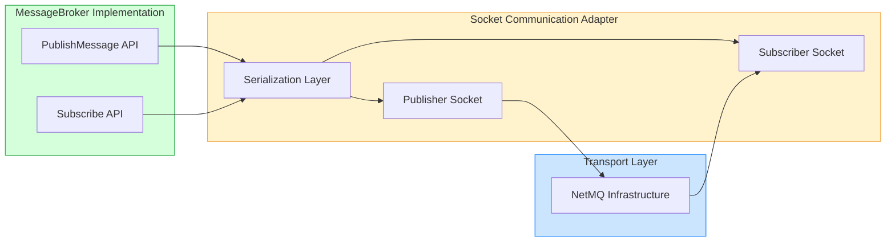

# MSA.Foundation Messaging Architecture

## Detailed Messaging Flow

```mermaid
graph TB
    subgraph Publisher["Publisher Service"]
        P_App["Application Code"]
        P_Msg["Creates Message"]
        P_Broker["MessageBroker"]
        P_Socket["SocketCommunicationAdapter"]
        
        P_App -- "1. Create message" --> P_Msg
        P_Msg -- "2. PublishMessage(message)" --> P_Broker
        P_Broker -- "3. Serialize to JSON" --> P_Broker
        P_Broker -- "4. SendMessage(topic, json)" --> P_Socket
        P_Socket -- "5. Send via NetMQ" --> Net
    end
    
    Net["Network/Transport Layer"]
    
    subgraph Subscriber["Subscriber Service"]
        S_Socket["SocketCommunicationAdapter"]
        S_Broker["MessageBroker"]
        S_Handler["Message Handler"]
        S_App["Application Code"]
        
        Net -- "6. Receive via NetMQ" --> S_Socket
        S_Socket -- "7. OnMessageReceived(topic, payload)" --> S_Broker
        S_Broker -- "8. Deserialize from JSON" --> S_Broker
        S_Broker -- "9. Invoke subscriber callback" --> S_Handler
        S_Handler -- "10. Process message" --> S_App
    end
    
    %% Add acknowledgment flow
    S_Broker -. "A1. Create acknowledgment" .-> S_Broker
    S_Broker -. "A2. PublishMessage(ack)" .-> S_Socket
    S_Socket -. "A3. Send via NetMQ" .-> Net
    Net -. "A4. Receive via NetMQ" .-> P_Socket
    P_Socket -. "A5. OnMessageReceived(topic, ack)" .-> P_Broker
    P_Broker -. "A6. Notify ack handlers" .-> P_App
    
    classDef flowSteps fill:#f9f9f9,stroke:#333,stroke-width:1px
    classDef ackFlow fill:#fcfdd8,stroke:#765821,stroke-width:1px,stroke-dasharray: 5 5
    class P_App,P_Msg,P_Broker,P_Socket,S_Socket,S_Broker,S_Handler,S_App flowSteps
    class Net ackFlow
```

## Message Structure and Processing

```mermaid
classDiagram
    class Message {
        +MessageId: string
        +MessageType: MessageType
        +SenderId: string
        +ReceiverId: string
        +Timestamp: DateTime
        +Payload: string
        +Headers: Dictionary~string, string~
        +RequireAcknowledgment: bool
        +AcknowledgmentId: string
    }
    
    class MessageProcessor {
        Process message and route to handlers
    }
    
    class MessageHandlers {
        Callbacks registered by components
    }
    
    Message --> MessageProcessor : is processed by
    MessageProcessor --> MessageHandlers : invokes handlers
```

## Socket Communication Adapter Pattern

```mermaid
flowchart LR
    subgraph MsgBroker["MessageBroker Implementation"]
        PublishAPI["PublishMessage API"]
        SubscribeAPI["Subscribe API"]
    end
    
    subgraph Adapter["Socket Communication Adapter"]
        PubSock["Publisher Socket"]
        SubSock["Subscriber Socket"]
        Serialization["Serialization Layer"]
    end
    
    subgraph Transport["Transport Layer"]
        NetMQ["NetMQ Infrastructure"]
    end
    
    PublishAPI --> Serialization
    SubscribeAPI --> Serialization
    Serialization --> PubSock
    Serialization --> SubSock
    PubSock --> NetMQ
    NetMQ --> SubSock
    
    style MsgBroker fill:#d4ffda,stroke:#28a745
    style Adapter fill:#fff3cd,stroke:#f0ad4e
    style Transport fill:#cce5ff,stroke:#007bff
```