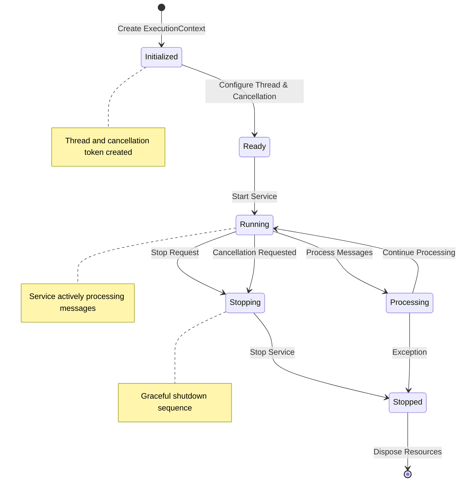
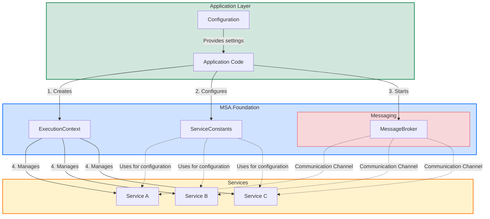
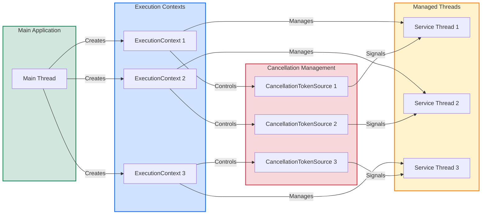
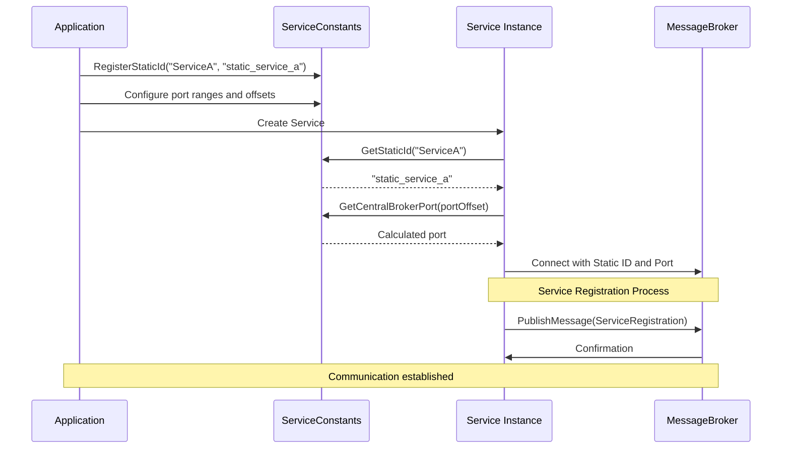

# MSA.Foundation Service Management Architecture

## Service Lifecycle Management

## Service Management Components Interaction

## Thread Management Model

## Service Configuration and Discovery

