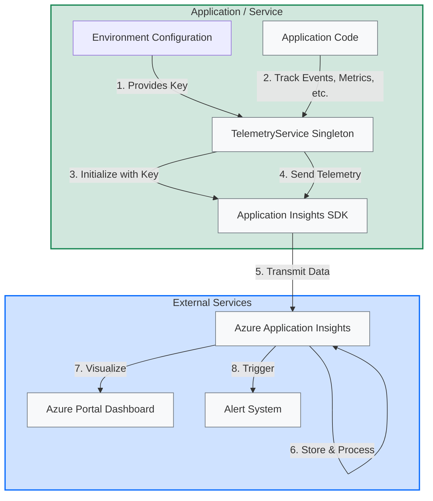
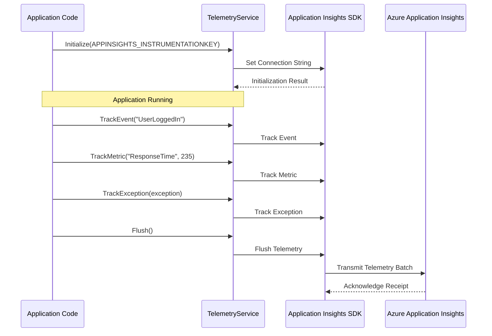
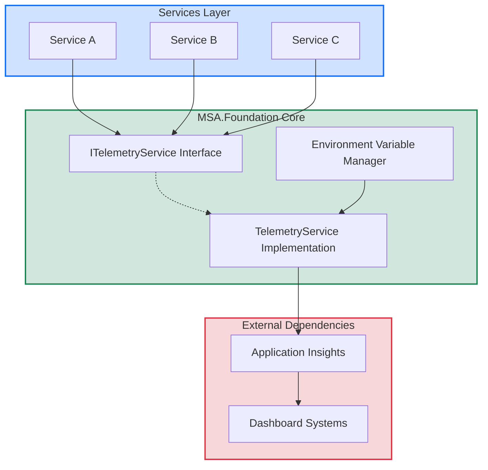

# MSA.Foundation Telemetry Architecture

## Telemetry System Design

```mermaid
graph TD
    subgraph Application["Application / Service"]
        style Application fill:#d1e7dd,stroke:#198754,stroke-width:2px
        
        AppCode["Application Code"]
        TelemetryService["TelemetryService Singleton"]
        TelemetrySdk["Application Insights SDK"]
        EnvConfig["Environment Configuration"]
    end
    
    subgraph ExternalServices["External Services"]
        style ExternalServices fill:#cfe2ff,stroke:#0d6efd,stroke-width:2px
        
        AppInsights["Azure Application Insights"]
        AzurePortal["Azure Portal Dashboard"]
        Alerts["Alert System"]
    end
    
    EnvConfig -->|"1. Provides Key"| TelemetryService
    AppCode -->|"2. Track Events, Metrics, etc."| TelemetryService
    TelemetryService -->|"3. Initialize with Key"| TelemetrySdk
    TelemetryService -->|"4. Send Telemetry"| TelemetrySdk
    TelemetrySdk -->|"5. Transmit Data"| AppInsights
    AppInsights -->|"6. Store & Process"| AppInsights
    AppInsights -->|"7. Visualize"| AzurePortal
    AppInsights -->|"8. Trigger"| Alerts
    
    classDef flow fill:#f8f9fa,stroke:#6c757d,stroke-width:1px
    class AppCode,TelemetryService,TelemetrySdk,AppInsights,AzurePortal,Alerts flow
```

## Telemetry Data Flow

```mermaid
sequenceDiagram
    participant App as Application Code
    participant TelSvc as TelemetryService
    participant TelSdk as Application Insights SDK
    participant AppIns as Azure Application Insights
    
    App->>TelSvc: Initialize(APPINSIGHTS_INSTRUMENTATIONKEY)
    TelSvc->>TelSdk: Set Connection String
    TelSdk-->>TelSvc: Initialization Result
    
    Note over App,TelSvc: Application Running
    
    App->>TelSvc: TrackEvent("UserLoggedIn")
    TelSvc->>TelSdk: Track Event
    
    App->>TelSvc: TrackMetric("ResponseTime", 235)
    TelSvc->>TelSdk: Track Metric
    
    App->>TelSvc: TrackException(exception)
    TelSvc->>TelSdk: Track Exception
    
    App->>TelSvc: Flush()
    TelSvc->>TelSdk: Flush Telemetry
    
    TelSdk->>AppIns: Transmit Telemetry Batch
    AppIns-->>TelSdk: Acknowledge Receipt
```

## Telemetry Integration Architecture

```mermaid
flowchart TB
    subgraph Core["MSA.Foundation Core"]
        TelIntf["ITelemetryService Interface"]
        TelImpl["TelemetryService Implementation"]
        EnvVar["Environment Variable Manager"]
    end
    
    subgraph Services["Services Layer"]
        Service1["Service A"]
        Service2["Service B"]
        Service3["Service C"]
    end
    
    subgraph External["External Dependencies"]
        AppInsights["Application Insights"]
        DashboardSystems["Dashboard Systems"]
    end
    
    TelIntf -.-> TelImpl
    EnvVar --> TelImpl
    
    Service1 --> TelIntf
    Service2 --> TelIntf
    Service3 --> TelIntf
    
    TelImpl --> AppInsights
    AppInsights --> DashboardSystems
    
    style Core fill:#d1e7dd,stroke:#198754,stroke-width:2px
    style Services fill:#cfe2ff,stroke:#0d6efd,stroke-width:2px
    style External fill:#f8d7da,stroke:#dc3545,stroke-width:2px
```