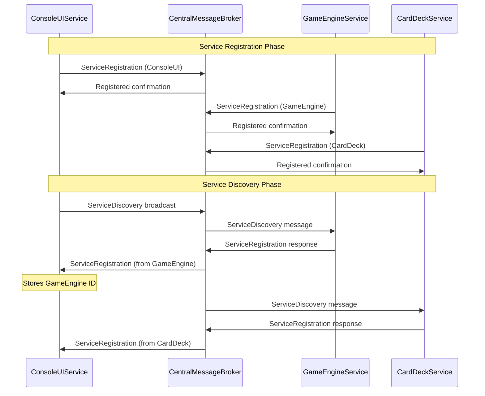
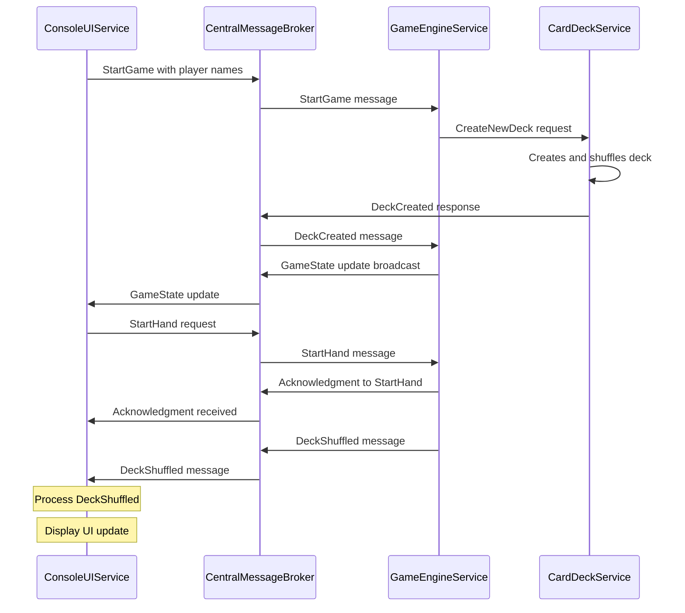
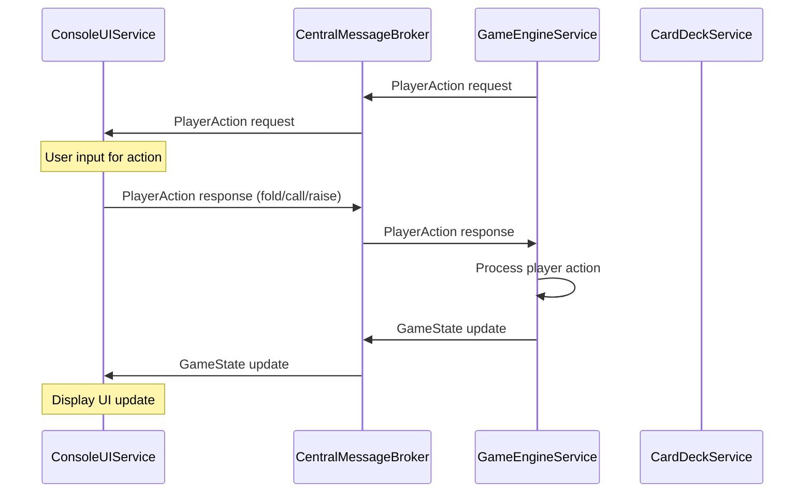
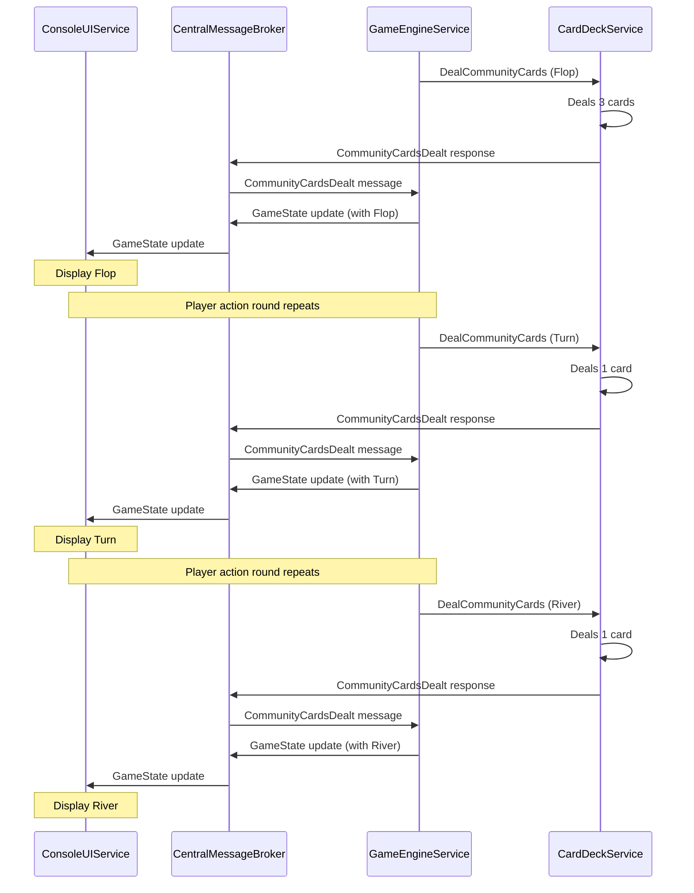
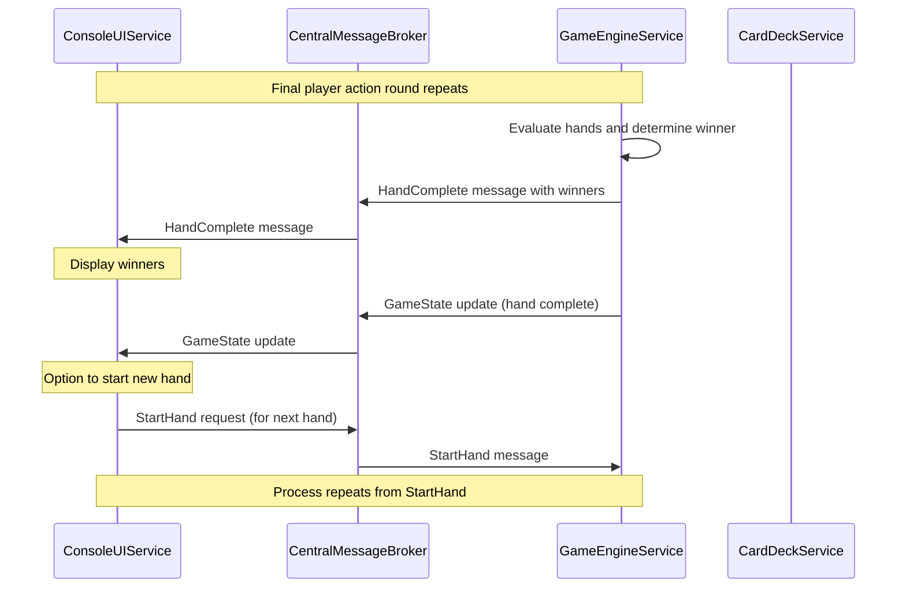
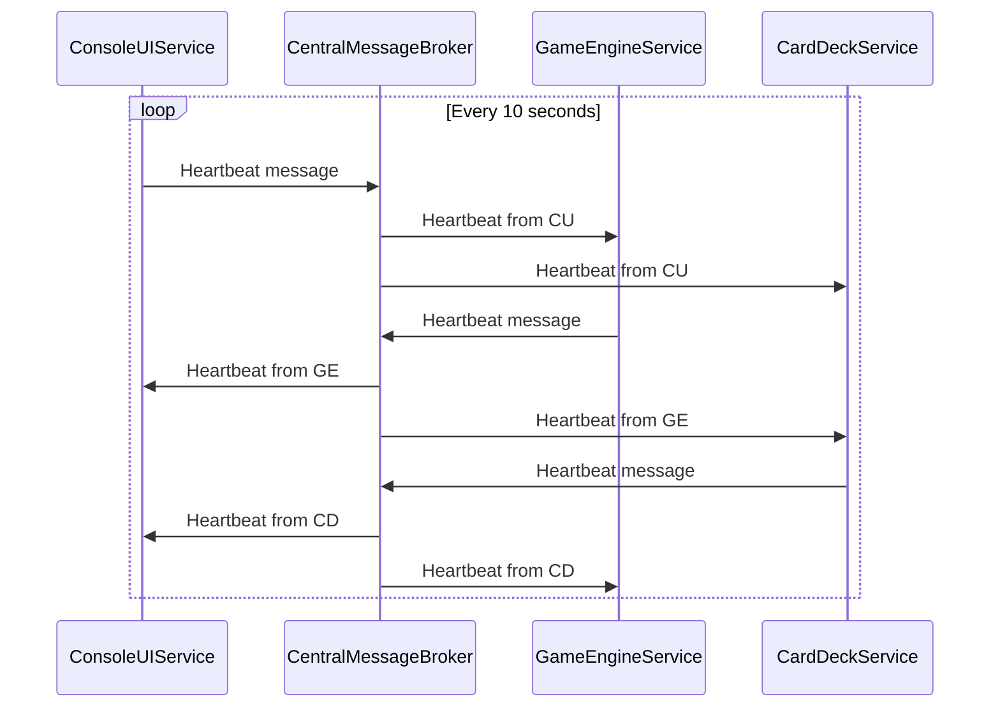

# Poker Game Message Flow Diagram

The following diagram illustrates the message flow between the different microservices in the poker game architecture.

## Game Initialization and Service Discovery

## Game Start and Hand Dealing Sequence

## Player Action Sequence

## Community Card Dealing Sequence

## Hand Completion and Winner Determination

## Heartbeat and Health Check

## Message Types and Flow Summary

| Message Type | Direction | Purpose |
|--------------|-----------|---------|
| ServiceRegistration | All → CMB | Microservices register with the broker |
| ServiceDiscovery | CU → CMB → All | ConsoleUI discovers available services |
| StartGame | CU → CMB → GE | Begin a new game with players |
| CreateNewDeck | GE → CD | Request to create and shuffle a new deck |
| DeckCreated | CD → CMB → GE | Notification that a new deck is ready |
| StartHand | CU → CMB → GE | Start a new hand of poker |
| DeckShuffled | GE → CMB → CU | Notification that deck is shuffled for new hand |
| PlayerAction | GE → CMB → CU (request)   CU → CMB → GE (response) | Request player action and send response |
| DealCommunityCards | GE → CD | Request to deal community cards (flop/turn/river) |
| CommunityCardsDealt | CD → CMB → GE | Notification that community cards have been dealt |
| GameState | GE → CMB → CU | Update UI with current game state |
| HandComplete | GE → CMB → CU | Notification of hand completion with winners |
| Heartbeat | All → CMB → All | Health check messages |
| Acknowledgment | All → CMB → All | Confirm message receipt |

## Critical Message Flow Issues

1. **StartHand → DeckShuffled Flow**: 
   - ConsoleUI sends StartHand to GameEngine
   - GameEngine should respond with DeckShuffled
   - ConsoleUI must handle DeckShuffled to continue game flow
   - If DeckShuffled handler is missing, game stalls

2. **Service Discovery Cycle**:
   - ConsoleUI must discover GameEngine before game can start
   - If discovery fails, ConsoleUI falls back to static service IDs
   - Proper registration/discovery ensures dynamic service communication

3. **Message Conversion**:
   - Messages convert between MSA.Foundation.Messaging.Message and PokerGame.Core.Messaging.NetworkMessage formats
   - MessageType enum references must be fully qualified to avoid ambiguity
   - Headers like "MessageSubType" aid in routing between services